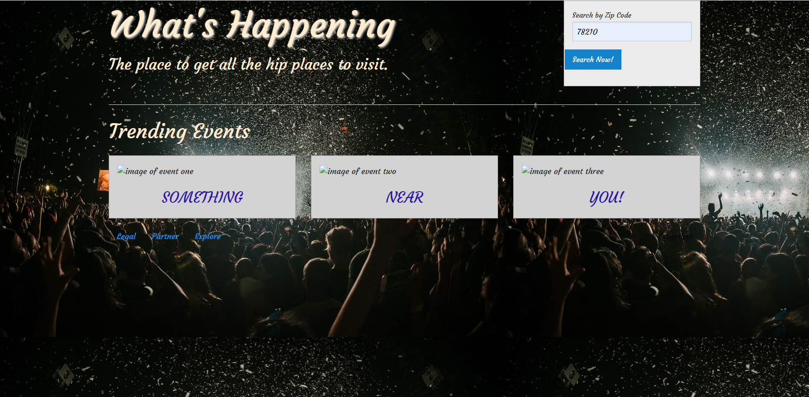

# What's Happening
## Overview
Looking for the coolest events in your area??? What's Happening is a simple Web-app to search events in your area by zip code. Search a zip code and see all the happening spots around you! 
## Detail Usage
- Open What's Happening
- Click in search bar and enter a zip code
- Three trending events in your area will appear
## API Used
Yelp
## Built With
- HTML
- CSS
- JavaScript
- Foundation
## screen Shot 

## Links
repository: https://github.com/MSarfarazH/WhatsHappeningEventFinder

Github Pages: https://msarfarazh.github.io/WhatsHappeningEventFinder/

